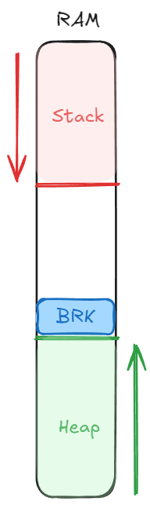

# 03/03/2025

## Les composants nécessaires au C

Le C nécessite 2 composant primaires pour fonctionner:

### Le CPU

Dans ce dernier, nous traiterons els données de manière rapide grâce:

- L’ALU (Arithmetical Logical Unit): Qui permet d’exécuter des opérations mathématiques:
    - AND
    - OR
    - NOT
    - SHL
    - SHR
    - Add
    - …
- Les registres: Qui permettent de stocker des valeurs pour ensuite les utiliser dans les opérations de l’ALU.

### La RAM

Dans cette dernière, nous stockons les données, elle est vive (variable) et contient notamment:

- La stack: Une pile organisée des processus à éxécuter
- La heap: Une autre pile, plus utilisée sous la forme d’une mise en tampon, qui est donc désorganisée
- Mais aussi différent types de variables, cependant, nous ne pouvons pas les stocker de manière brute, en effet, la RAM ne peut contenir que des bits, il est donc nécessaire de transformer nos données et appliquer une logique afin de les traiter.

### Terminal

Terminal → Interface permettant aux humains de facilement contrôler une machine, plusieurs terminaux peuvent êtres connectés à la machine

Cet élément nous permet surtout de débuguer, mais n’est pas essentiel

Aujourd’hui, les terminaux sont simulés et nous permettent de communiquer avec le kernel

Les protocoles d’envoi de données entre le terminal et le clavier sont différents:

commandes d’affichage  = Protocole ASCII

Frappe de clavier = Protocole différent

---

## Fonctionnement de la RAM

Pour commencer, nous allons nous intéresser sur les types de données primaires à exécuter

### Les caractères

Différents encodages existent pour transformer une valeur binaire en un caractère.

L’ASCII: Le format le plus historique, il encode les caractères sur 1 octet, cependant, seulement 4 bits sont vraiment utilisés de bases. Ces dernier sont depuis été étendus avec la Extended ASCII Codes qui utilise les valeurs restantes. Du fait de sa taille, elle ne possède pas beaucoup de caractères, elle a cependant été crée pour être pratique d’utilisation, de ce fait, il existe des valeurs de référence.

- 0x30 → 0x39: Chiffres de 1 à 9
- 0x41 → 0x5A: Lettres majuscule de A à Z
- 0x61 → 0x7A: Lettres minuscule de A à Z
- 0xD → Caractère de contrôle CR

Les caractères de contrôle permettent d’exécuter des fonctions. Par exemple avec une imprimante:

- CR → Charriage return, permet de faire revenir à la première position le chariot
- LF → Line Feed, permet de faire défiler de 1 ligne la page

---

L’UTF-8: Encode les lettres sur 1 octet, est plus optimisé car il permet de facilement être reconnu:

- L’encodage du premier octet commence toujours par 11
- Les octets suivants commencent par 10

L’UTF-8 est l’encodage le plus utilisé aujourd’hui. Majoritairement grâce au web

---

L’UTF-32: 4 octets par caractère, permet d’avoir beaucoup plus de caracères

### Les nombres

1 nombre = 1 octet de base

Cependant, avec les processeurs 64bits (qui définit la taille maximale traitable), nous pouvons atteindre: 1 nombre = 8 octets

Cependant, nous pouvons nativement uniquement stocker des nombres positifs en binaire. Il est donc nécessaire de créer des manières d’utiliser les autre types:

- Positifs: 0 à 18446744073709551615 soit 2**64 valeurs
- Négatif:
    - Avec les bits signés: de -, mais poses problème car impossibilité de faire des opérations et 2 représentations de 0.
    - Donc, nous stockons les nombres négatifs en complément à 2 et les nombres positifs normalement
- A virgule: 1 bit de signe, 52 bits pour la mantisse, 11 pour l’exposant (en valeur biaisé)
    - Ex: -123^(-61) :
        
         - par le bit de signe, 123 pour la mantisse, -63 pour l’exposant
        

### Les instructions

Nous allons ici utiliser un ID qui correspond à une fonction prédéfinie, nous utilisons alors une table de correspondance pour connaitre quelle fonction utiliser. Cette rubrique est détaillée plus bas

### Heap et Stack

La heap et la stack permettent de contenir la liste des instructions à exécuter. Ces dernières sont sous la forme d’une pile. Ces dernières sont dynamiques et gérées par notre programme au travers du CPU.

| Heap | Stack |
| --- | --- |
| Présente en fin de ram et la remonte | La stack grandit du haut vers le bas. |
| Grandit en poussant ce que l’on appelle le `BRK` |  |
| Contient majoritairement des objets qui doivent vivre longtemps |  Elle contient des objets temporaires et rapides à traiter. |
| Nous gérons indépendamment la durée de vie des fonctions | La durée de vie de la stack est liée à la durée de vie des fonctions |



Nous allons nous focaliser sur la stack, qui est la plus importante:


Illustration de la stack à son état  maximal dans le cadre de l’exécution de la fonction fib(3). Nous pouvons voir que chaque appel fonction prend de la place dans la stack

---

## Fonctionnement du CPU

### Registres

Les registres sont des cases mémoires de la taille du type du système (ex: un ordinateur 64 bits possède des registres de 64 bits(en théorie)). Ces derniers peuvent ensuite êtres utilisés au travers des instructions.

| Acronyme | Nom | Rôle |
| --- | --- | --- |
| IP | Instruction Pointer | Contient la valeur de l’instruction à exécuter. Elle s’incrémente au long du programme en prenant en compte la longueur des instructions. L’IP est de base géré dans le CPU |
| SP  | Stack Pointer | Contient la taille de la Stack |
| RDI{X} |  | Registre de base pour les paramètres d’une fonction |
| RAX |  | Registre de base pour les retours d’une fonction |
| R{X} |  | Format |

### Instructions

Afin de pouvoir faire exécuter des instructions au processeur, nous utilisons des ID qui correspondent individuellement à une `instruction` prédéfinie du côté du processeur.

| Acronyme | Nom | Rôle | Arguments |
| --- | --- | --- | --- |
| ADD | Addition | Permet d’additionner 2 valeurs | Registre contenant la valeur à additionner  |
| POP  |  | Prend la valeur dans la Stack pour la mettre dans le registre | Registre destination |
| SYSCALL  |  | Permet de faire un syscall |  |
| MOV  |  | Permet de déplacer une valeur dans un registre | Valeur (immédiat), registre de destination |
| PUSH |  | Permet de mettre la valeur d’un registre dans la Stack | Registre  |
| MOVRR | Registre vers Registre | Permet de transférer la valeur d’un registre vers un autre | Registre source, registre destination |
| SUB | Subtract | Permet de soustraire la valeur  | Registre contenant la valeur à soustraire |
| RET | Restore IP | Affecte un nouveau IP depuis le registre | La valeur IP |
| CMP |  | Compare la valeur d’un registre à une valeur donnée | Le registre et la valeur (immédiate) à comparer |
| LEAVE |  | Permet de remettre la Stack dans l’état précédant |  |
| JE | Jump Equal | Permet de faire un saut sous condition |  |

Pour arrêter l’exécution d’un programme, nous devons communiquer une demande d’arrêt au kernel au travers des `syscalls`.

### Syscalls

Les syscalls possèdent comme pour les fonctions processeurs des ID spécifiques à appeler. Des exemples de syscalls peuvent êtres:

| Nom | Fonction | R1 / ID | R2 | R3 | R4 |
| --- | --- | --- | --- | --- | --- |
| exit | Permet de tuer le processus | 1 | Code erreur:
0: OK
1: Non OK | X |  |
| write  | Permet d’afficher du texte peu importe l’écran | 2 | Tyoe de msg:
1: std
2: err | Numéro de la case mémoire qui contient la 1ere lettre | Nombre de caractère à afficher |
| read |  |  |  |  |  |

- Exemple de code assembleur de la fonction Fibonacci:
    
    ```python
    global main
    
    fib:
        push rbp
        mov rbp, rsp
        cmp rdi, 1
        je .fib_ret_1
        cmp rdi, 2
        je .fib_ret_1
        push rdi
        sub rdi, 1
        call fib
        pop rdi
        push rax
        sub rdi, 2
        call fib
        add rax, [rsp]
        leave
        ret
    .fib_ret_1:
        mov rax, 1
        leave
        ret
    
    print_int:
        push rbp
        mov rbp, rsp
    
        mov rax, rdi
        mov rdx, 0
        mov rbx, 10
        div rbx
        cmp rdi, 10
        jl .print_int_end
        push rdx
        mov rdi, rax
        call print_int
        pop rdx
    .print_int_end:
        add rdx, 0x30
        push rdx
        mov rax, 1      ; syscall write
        mov rdi, 1      ; first argument (fd)
        mov rsi, rsp    ; second argument (buf)
        mov rdx, 1      ; third argument (count)
        syscall
        leave
        ret
    
    atoi:
        mov rax, 0
    .loop:
        xor rbx, rbx
        mov bl, [rdi]
        cmp bl, 0
        je .return
        mov rcx, 10
        mul rcx
        sub bl, 0x30
        add rdi, 1
        add rax, rbx
        jmp .loop
    .return:
        ret
    
    main:
        push rbp
        mov rbp, rsp
    
        mov rdi, [rsi+8]            ; rdi = argv[1]
    
        call atoi
        mov rdi, rax
        call fib
    
        mov rdi, rax
        call print_int
    
        push 0x0000000A
        mov rax, 1
        mov rdi, 1
        mov rsi, rsp
        mov rdx, 1
        syscall
    
        mov rdi, 0
        mov rax, 60
        syscall
    ```